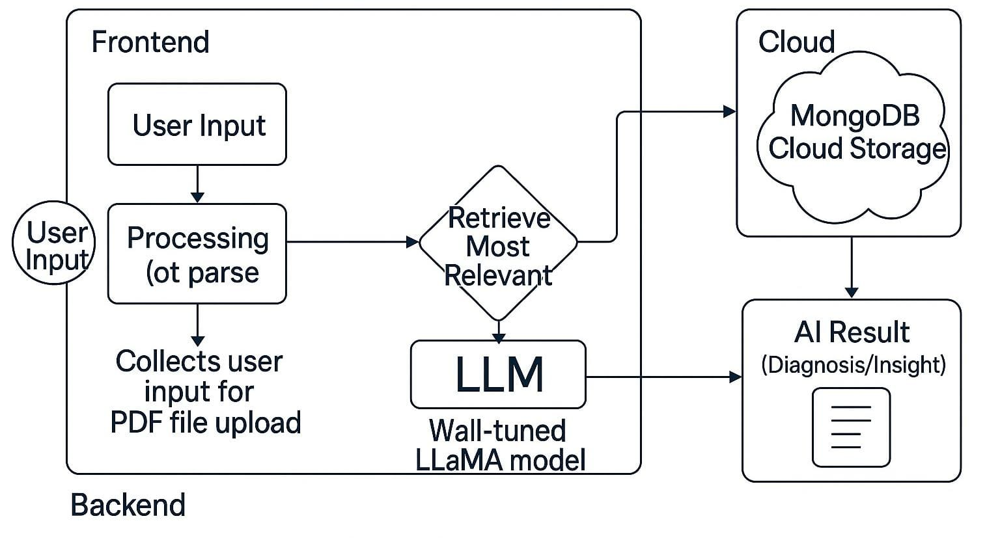

# Elixer AI: RAG-Enabled LLM for Automated Medical Report Analysis and Actionable Health Insights



Elixer AI is a next-generation medical diagnostics assistant built with Retrieval-Augmented Generation (RAG)-enabled Large Language Model (LLM) capabilities. Unlike traditional report viewers, Elixer AI interprets biomarkers from medical lab reports (blood, urine, sperm, stool, and pap smear) with clinical precision, providing actionable health insights, visualization, and daily biomarker tracking. The platform supports secure report uploads, multi-report monitoring, and privacy-aware diagnostics.

---

## 🔧 Project Structure

```
Elixer/
├── client/           # React frontend for dashboard, charts, and report upload
│   └── src/         # Source files for UI components
├── server/          # Node.js backend
│   ├── data/        # PDF biomarker extraction logic and temporary data storage
│   └── routes/      # API endpoints for data exchange between client and server
├── package.json     # Project configuration and dependencies
├── LICENSE          # MIT License
└── README.md        # Project documentation
```

---

## ✨ Key Features

* 🔄 Retrieval-Augmented Generation for biomarker-aware interpretation
* 📋 Daily health monitoring with multi-report comparison
* 📈 Real-time data visualization with Recharts, Chart.js, and MUI Charts
* 🔒 AI-poisoning protection and privacy-safe architecture
* 🚀 Vision-LLM readiness for future medical imaging support (X-Ray, MRI, ECG, etc.)
* ⚙️ EHR/Hospital integration-ready backend

---

## 🚀 Technologies Used

* React.js 18.3.1
* Node.js + Express (Backend API)
* MongoDB (Database for biomarker tracking and session storage)
* AWS S3, EC2, IAM (Cloud storage and hosting)
* Google Gemini AI (LLM embedding and RAG processing)
* PDF parsing tools: `pdf-parse`, `pdf2table`
* Chart libraries: Recharts, Chart.js, Material UI Charts
* FontAwesome (Icons and visuals)

---

## ✅ Getting Started

### Prerequisites

* Node.js (Latest LTS recommended)
* npm (comes with Node.js)

### Installation

```bash
# Clone the repository
git clone https://github.com/lakshayysinghh/elixer-ai.git
cd elixer-ai

# Install dependencies for both client and server
cd client && npm install
cd ../server && npm install
```

### Run the Application

```bash
# In separate terminals:
cd client
npm start

cd server
npm start
```

The app will be available at `http://localhost:3000`

---

## 📅 Development Workflow

* **Client**: Built with React and MUI, handles UI interactions, report uploads, and chart rendering.
* **Server**: Node.js server extracts biomarker data from uploaded PDF reports and communicates with the LLM engine.
* **Cloud Integration**: Reports are stored on AWS S3, and analysis is powered by Gemini AI with RAG logic for biomarker reasoning.

---

## 🚧 Future Extensions

* 📊 AI-based medical imaging analysis (X-Ray, MRI, ECG, EEG)
* 📆 Integration with hospital systems and appointment schedulers
* 🏥 EHR system connectivity for real-time diagnostics syncing

---

## ✍️ Contributing

We welcome contributors to help improve Elixer AI!

1. Fork this repository
2. Create a new branch (`git checkout -b feature/YourFeature`)
3. Commit your changes (`git commit -m 'Add your feature'`)
4. Push to your branch (`git push origin feature/YourFeature`)
5. Open a Pull Request

---

## 📚 License

This project is licensed under the **MIT License** - see the `LICENSE` file for details.

---

## 👏 Acknowledgments

* React team for the frontend ecosystem
* Chart.js, Recharts, and MUI for interactive visualizations
* AWS and Google for cloud and AI services
* FontAwesome for beautiful UI icons


